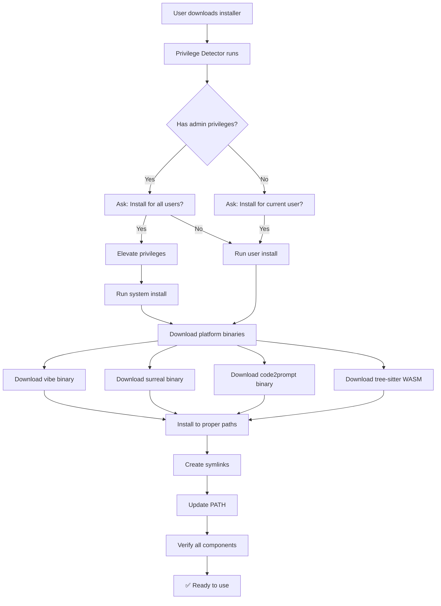

# Dotvibe Installer Architecture

Modern, non-intrusive distribution system with privilege-aware installation and cross-platform binary downloads.

## 🏗️ Architecture Overview

The dotvibe distribution uses a **two-installer approach**:
1. **Privilege Detector** - Detects permissions and handles elevation
2. **Binary Installer** - Downloads platform-specific binaries directly (no toolchain installation)

### Installation Flow



## 📁 File Architecture

### Core Installer Files

| File | Purpose | Dependencies |
|------|---------|--------------|
| [`elevate.go`](./elevate.go) | **Privilege detector and elevator** | Handles admin detection and elevation |
| [`main.go`](./main.go) | **Binary installer logic** | Downloads platform-specific binaries |
| [`paths.go`](./paths.go) | **Cross-platform path management** | System vs user install paths |
| [`Taskfile.yml`](./Taskfile.yml) | Build automation for cross-platform installers | Reads version from ../deno.json |

### Deno Project Files

| File | Purpose | Role in Installation |
|------|---------|---------------------|
| [`../src/infra/ast.ts`](../src/infra/ast.ts) | AST parsing with WASM file resolution | Looks for proper data directory |
| [`../data/README.md`](../data/README.md) | Documentation bundled with executable | Included in compiled binary |
| [`../deno.json`](../deno.json) | Build configuration | Defines version, includes data/ directory |
| [`../scripts/build-all-platforms.sh`](../scripts/build-all-platforms.sh) | Cross-platform Deno builds | Creates platform-specific executables |

## 🔐 Version Lock System

All dependencies are locked with SHA256 checksums in [`main.go`](./main.go):

```go
const (
    CODE2PROMPT_VERSION    = "3.0.3"     // CLI tool for code extraction  
    SURREALDB_VERSION      = "2.3.5"     // Database system
    TREE_SITTER_TS_VERSION = "0.23.2"    // TypeScript/JavaScript parser
    
    // SHA256 checksums for security validation
    CODE2PROMPT_SHA256_LINUX   = "527c4c27e260e9ea3123c4a1e5d5d7734954543705945306c67b3018ca16bd34"
    CODE2PROMPT_SHA256_MACOS   = "deb28f718e550089eebad9110564776494d172b72acb95befff5fc6dcaba9e5e"
    CODE2PROMPT_SHA256_WINDOWS = "b09fb5d0fda5b40097f1df1762103024097847e871b3d8b3eae1e361e03064a1"
)
```

### Why Version Locking + Checksums?
- **Reproducible builds**: Same versions across all installations
- **Compatibility guarantee**: Tested combinations that work together  
- **Security**: SHA256 validation prevents tampering
- **No toolchain pollution**: Direct binary downloads only

## 🚀 Installation Process

### 1. Download and Run
```bash
# User downloads platform-specific installer
curl -L https://github.com/vhybzOS/dotvibe/releases/latest/download/install-dotvibe-linux-x86_64 -o install-dotvibe
chmod +x install-dotvibe
./install-dotvibe
```

### 2. Privilege Detection and User Choice
- **Detect current privileges** (admin/user)
- **Ask user**: "Install for all users (system) or current user only?"
- **Handle elevation**: If system install chosen, elevate privileges appropriately

### 3. Direct Binary Downloads (No Toolchain Installation!)

#### Platform-Specific Binaries
```bash
# SurrealDB from official releases
https://download.surrealdb.com/v2.3.5/surreal-v2.3.5.{os}-{arch}{.ext}

# code2prompt from our fork (includes Windows!)
https://github.com/vhybzOS/code2prompt/releases/download/v3.0.3/code2prompt-{target}{.exe}

# Tree-sitter WASM
https://unpkg.com/tree-sitter-typescript@0.23.2/tree-sitter-typescript.wasm

# Vibe executable
https://github.com/vhybzOS/dotvibe/releases/download/{version}/vibe-{version}-{os}-{arch}{.exe}
```

#### SHA256 Validation
- **Verify checksums** of all downloaded binaries
- **Fail installation** if any checksum mismatch detected
- **Security**: Prevents tampering and corruption

### 4. Versioned Installation Structure

#### System Installation (with admin privileges)
- **Location**: `/usr/local/dotvibe/{version}/` (Unix) or `C:\Program Files\dotvibe\{version}\` (Windows)
- **Layout**: `vibe` executable and `data/` directory co-located for consistent `./data/` paths
- **Symlink**: `/usr/local/bin/vibe` → `/usr/local/dotvibe/{version}/vibe`
- **Available to**: All users on system

#### User Installation (no admin needed)
- **Location**: `~/.local/dotvibe/{version}/` (Unix) or `%APPDATA%\dotvibe\{version}\` (Windows)
- **Layout**: `vibe` executable and `data/` directory co-located for consistent `./data/` paths
- **Symlink**: `~/.local/bin/vibe` → `~/.local/dotvibe/{version}/vibe`
- **Available to**: Current user only

### 5. Symlink Strategy and PATH Management
- **Create symlinks**: Point to versioned binaries for easy updates
- **Update PATH**: Add binary directory to user/system PATH
- **Shell integration**: Update profile files (.bashrc, .zshrc, PowerShell profile)

### 6. Verification and Uninstall Support
- **Binary check**: `vibe --version`, `surreal version`, `code2prompt --version`
- **Integration test**: Ensure WASM files are accessible
- **Uninstall support**: `./install-dotvibe --uninstall` removes everything cleanly

## 📦 Build Artifacts

### Release Assets Structure

Each GitHub release contains:

```
# Deno Executables (self-contained)
vibe-v0.4.0-linux-x86_64           # Linux x86_64
vibe-v0.4.0-darwin-x86_64          # macOS Intel  
vibe-v0.4.0-darwin-arm64           # macOS Apple Silicon
vibe-v0.4.0-windows-x86_64.exe     # Windows x86_64

# Go Installers (dependency managers)
install-dotvibe-linux-x86_64       # Linux installer
install-dotvibe-darwin-x86_64      # macOS Intel installer
install-dotvibe-darwin-arm64       # macOS Apple Silicon installer  
install-dotvibe-windows-x86_64.exe # Windows installer
```

### Build Commands

#### Deno Executables
```bash
# Single platform
deno task build

# All platforms  
deno task build:cross-platform
```

#### Go Installers
```bash
# Single platform
cd installer && task build

# All platforms
cd installer && task build:all
```

## 🔄 Runtime Path Resolution

### Unified Approach (Development + Production)
**Location**: [`../src/infra/ast.ts`](../src/infra/ast.ts)

With the versioned installation structure, path resolution is simplified:

```typescript
// Consistent across all environments:
const wasmPath = `./data/tree-sitter-typescript.wasm`

// Development: ./vibe and ./data/ co-located in repo
// Production: vibe and data/ co-located in versioned install directory
// No complex fallback logic needed!
```

**Benefits**:
- **Consistent paths**: `./data/` works in development and production
- **Simplified logic**: No need for complex executable directory detection
- **Reliable resolution**: WASM files always found relative to executable

## 🎯 Installation Locations

### System Installation Paths (Admin Required)

| Component | Linux/macOS | Windows | Purpose |
|-----------|-------------|---------|---------|
| **Install Directory** | `/usr/local/dotvibe/{version}/` | `C:\Program Files\dotvibe\{version}\` | Versioned install location |
| **Executables** | `{install_dir}/vibe`, `{install_dir}/surreal`, etc. | Same + `.exe` | All binaries co-located |
| **Data** | `{install_dir}/data/` | Same | WASM files, configs (relative to executables) |
| **PATH Symlinks** | `/usr/local/bin/vibe` → `{install_dir}/vibe` | Copy to `C:\Windows\System32\` | Global access |

### User Installation Paths (No Admin Required)

| Component | Linux/macOS | Windows | Purpose |
|-----------|-------------|---------|---------|
| **Install Directory** | `~/.local/dotvibe/{version}/` | `%APPDATA%\dotvibe\{version}\` | Versioned install location |
| **Executables** | `{install_dir}/vibe`, `{install_dir}/surreal`, etc. | Same + `.exe` | All binaries co-located |
| **Data** | `{install_dir}/data/` | Same | WASM files, configs (relative to executables) |
| **PATH Symlinks** | `~/.local/bin/vibe` → `{install_dir}/vibe` | Update `%PATH%` environment | User access |

### System Requirements
- **Disk space**: ~50MB total (no Rust toolchain!)
- **Network**: Required for initial download only
- **Permissions**: User directory OR admin privileges (user's choice)

## 🔧 Development & Testing

### Contributing to Installer

If you want to contribute to the installer module, you'll need:
- **Go**: Install from https://go.dev/doc/install  
- **Task**: Install from https://taskfile.dev/installation

Development is now much simpler - no Rust toolchain required! Just build and run:

```bash
cd installer
task build
./install-dotvibe --help  # See available options
```

The installer now downloads pre-built binaries instead of building from source, making development much faster and more reliable. 🚀

### Local Testing
```bash
# Build installer
cd installer && task build

# Test user installation
./install-dotvibe --user

# Test system installation  
sudo ./install-dotvibe --system

# Test uninstallation
./install-dotvibe --uninstall

# Test developer mode (symlinks local ./vibe to PATH)
deno task build  # Build local vibe executable first
./install-dotvibe --dev  # Downloads WASM to ./data/, symlinks ./vibe

# Test integration
vibe --version && surreal version && code2prompt --version
```

### Adding New Dependencies

1. **Update version constants** in [`main.go`](./main.go)
2. **Add SHA256 checksums** for security validation
3. **Update download URLs** in binary fetching logic
4. **Add verification** to post-install checks
5. **Test cross-platform** with `task build:all`

## 🚨 Error Handling

### Common Installation Issues

| Error | Cause | Solution |
|-------|-------|----------|
| `Permission denied` | Insufficient privileges | Run with sudo for system install or choose user install |
| `Checksum mismatch` | Corrupted download/tampering | Re-download binary and validate |
| `Binary download failed` | Network/GitHub issue | Retry with verbose output |
| `PATH update failed` | Shell profile permissions | Manually add binary directory to PATH |

### Debug Mode
```bash
# Verbose installation
./install-dotvibe --verbose

# Manual verification
vibe --version
surreal version  
code2prompt --version
ls -la ~/.local/share/dotvibe/  # User install
ls -la /usr/local/share/dotvibe/  # System install
```

### Uninstall Support
```bash
# Clean removal of all components
./install-dotvibe --uninstall

# Removes:
# - All binaries (vibe, surreal, code2prompt)
# - Data directory and WASM files
# - PATH entries from shell profiles
# - Symlinks (Unix) or copied files (Windows)
```

## 📊 Success Metrics

After successful installation, users see:

```
✅ Installation complete!
🎉 Try: vibe --version

📦 Installed components:
   • vibe: v0.7.27
   • code2prompt: v3.0.3
   • surrealdb: v2.3.5  
   • tree-sitter-typescript: v0.23.2

📍 Installation type: System (available to all users)
📁 Install location: /usr/local/bin/
📊 Total disk usage: ~45MB
```

## 🔄 Update Strategy

### Version Bumps
1. **Update constants** in main.go with new versions and checksums
2. **Test compatibility** across all platforms
3. **Update documentation** and examples
4. **Release new installers** with automated builds

### Backward Compatibility
- **WASM API**: Maintained across tree-sitter versions
- **CLI interfaces**: Stable command signatures  
- **Installation paths**: Consistent across versions
- **Symlink strategy**: Enables seamless version switching

### Migration Support
- **Detect old installations** and offer to upgrade
- **Preserve user data** during upgrades
- **Clear migration path** from Rust-based to binary-based installs

---

This modern installer architecture provides a **non-intrusive, privilege-aware, and secure** distribution system that respects user choice while delivering a clean installation experience across all supported platforms.