# Dotvibe Installer Architecture

Complete distribution system for dotvibe with version-locked dependencies and cross-platform support.

## 🏗️ Architecture Overview

The dotvibe distribution uses a **hybrid approach**:
1. **Self-contained Deno executable** with bundled documentation
2. **Go installer** that handles all system dependencies and runtime assets

### Distribution Flow

```mermaid
graph TD
    A[User downloads installer] --> B[Go installer runs]
    B --> C[Check/Install Rust+Cargo]
    C --> D[Install code2prompt v3.0.2]
    D --> E[Install surrealdb v2.3.5]
    E --> F[Download tree-sitter WASM]
    F --> G[Download vibe executable]
    G --> H[Install to ~/.local/bin/]
    H --> I[Verify all components]
    I --> J[✅ Ready to use]
```



## 📁 File Architecture

### Core Installer Files

| File | Purpose | Dependencies |
|------|---------|--------------|
| [`main.go`](./main.go) | Main installer logic, GitHub releases, binary installation | Uses modules.go functions |
| [`modules.go`](./modules.go) | **Version-locked dependency management** | All external deps (Rust, cargo packages, WASM) |
| [`Taskfile.yml`](./Taskfile.yml) | Build automation for cross-platform installers | Reads version from ../deno.json |

### Deno Project Files

| File | Purpose | Role in Installation |
|------|---------|---------------------|
| [`../src/infra/ast.ts`](../src/infra/ast.ts) | AST parsing with WASM file resolution | Looks for `data/tree-sitter-typescript.wasm` |
| [`../data/README.md`](../data/README.md) | Documentation bundled with executable | Included in compiled binary |
| [`../deno.json`](../deno.json) | Build configuration | Defines version, includes data/ directory |
| [`../scripts/build-all-platforms.sh`](../scripts/build-all-platforms.sh) | Cross-platform Deno builds | Creates platform-specific executables |

## 🔐 Version Lock System

All dependencies are locked in [`modules.go`](./modules.go):

```go
const (
    CODE2PROMPT_VERSION    = "3.0.2"     // CLI tool for code extraction
    SURREALDB_VERSION      = "2.3.5"     // Database system
    TREE_SITTER_TS_VERSION = "0.23.2"    // TypeScript/JavaScript parser
)
```

### Why Version Locking?
- **Reproducible builds**: Same versions across all installations
- **Compatibility guarantee**: Tested combinations that work together
- **Security**: No surprise updates that could break functionality

## 🚀 Installation Process

### 1. Pre-Installation
```bash
# User downloads platform-specific installer
curl -L https://github.com/vhybzOS/dotvibe/releases/latest/download/install-dotvibe-linux-x86_64 -o install-dotvibe
chmod +x install-dotvibe
./install-dotvibe
```

### 2. Dependency Installation (modules.go)

#### Rust Toolchain
- **Check**: `cargo --version`
- **Install**: Via https://rustup.rs (cross-platform)
- **Verify**: Ensures cargo is available

#### Cargo Packages
```bash
cargo install code2prompt --version 3.0.2
cargo install surrealdb --version 2.3.5
```

#### WASM Runtime Asset
- **Download**: `https://unpkg.com/tree-sitter-typescript@0.23.2/tree-sitter-typescript.wasm`
- **Install to**: `~/.local/bin/data/tree-sitter-typescript.wasm`
- **Purpose**: TypeScript/JavaScript AST parsing for vibe

### 3. Main Binary Installation
- **Download**: Platform-specific vibe executable from GitHub releases
- **Install to**: `~/.local/bin/vibe`
- **Permissions**: Executable (chmod 755)

### 4. Verification
- **Binary check**: `vibe --version`
- **Dependencies**: Verify code2prompt and surreal commands work
- **Integration**: Ensure all components can communicate

## 📦 Build Artifacts

### Release Assets Structure

Each GitHub release contains:

```
# Deno Executables (self-contained)
vibe-v0.4.0-linux-x86_64           # Linux x86_64
vibe-v0.4.0-darwin-x86_64          # macOS Intel  
vibe-v0.4.0-darwin-arm64           # macOS Apple Silicon
vibe-v0.4.0-windows-x86_64.exe     # Windows x86_64

# Go Installers (dependency managers)
install-dotvibe-linux-x86_64       # Linux installer
install-dotvibe-darwin-x86_64      # macOS Intel installer
install-dotvibe-darwin-arm64       # macOS Apple Silicon installer  
install-dotvibe-windows-x86_64.exe # Windows installer
```

### Build Commands

#### Deno Executables
```bash
# Single platform
deno task build

# All platforms  
deno task build:cross-platform
```

#### Go Installers
```bash
# Single platform
cd installer && task build

# All platforms
cd installer && task build:all
```

## 🔄 Runtime Path Resolution

### Development Mode
**Location**: [`../src/infra/ast.ts:137-162`](../src/infra/ast.ts)

```typescript
// Uses Deno's npm cache
const cacheBase = `${Deno.env.get('HOME')}/.cache/deno/npm/registry.npmjs.org`
const wasmPath = `${cacheBase}/tree-sitter-typescript/0.23.2/tree-sitter-typescript.wasm`
```

### Compiled Executable Mode  
**Location**: [`../src/infra/ast.ts:116-135`](../src/infra/ast.ts)

```typescript
// Looks for installer-provided WASM file
const dataPath = `./data/tree-sitter-typescript.wasm`
// Fallback: relative to executable directory
const fallbackPath = `${executableDir}../data/tree-sitter-typescript.wasm`
```

## 🎯 Installation Locations

### User Installation Paths

| Component | Linux/macOS | Windows | Purpose |
|-----------|-------------|---------|---------|
| **vibe executable** | `~/.local/bin/vibe` | `%USERPROFILE%\.local\bin\vibe.exe` | Main CLI tool |
| **WASM file** | `~/.local/bin/data/tree-sitter-typescript.wasm` | `%USERPROFILE%\.local\bin\data\tree-sitter-typescript.wasm` | AST parsing |
| **cargo packages** | `~/.cargo/bin/` | `%USERPROFILE%\.cargo\bin\` | code2prompt, surreal |

### System Requirements
- **Disk space**: ~50MB total
- **Network**: Required for initial download
- **Permissions**: User directory write access

## 🔧 Development & Testing

### Contributing to Installer

If you want to contribute to the installer module, you'll need:
- **Go**: Install from https://go.dev/doc/install  
- **Task**: Install from https://taskfile.dev/installation

Once you have Go and Task installed, the installer can handle the rest of the dependencies for you! Just build and run it:

```bash
cd installer
task build
./install-dotvibe
```

This will set up Rust, cargo packages, and WASM files automatically. This makes contributing easy - you only need the basic development tools, and the installer bootstraps everything else. 😊

### Local Testing
```bash
# Build installer
cd installer && task build

# Test installation (dry run)
./install-dotvibe --help

# Build Deno executable
deno task build

# Test AST parsing
deno run --allow-all src/infra/ast.ts parse-file src/cli.ts
```

### Adding New Dependencies

1. **Update version constants** in [`modules.go`](./modules.go)
2. **Add installation logic** to `installAllModules()`
3. **Add verification** to `verifyAllModules()`
4. **Test cross-platform** with `task build:all`

## 🚨 Error Handling

### Common Installation Issues

| Error | Cause | Solution |
|-------|-------|----------|
| `Rust/Cargo not found` | Missing toolchain | Installer auto-installs via rustup |
| `cargo install failed` | Network/permissions | Retry with verbose output |
| `WASM download failed` | Network/CDN issue | Retry from unpkg.com |
| `Permission denied` | Install path restricted | Use different install directory |

### Debug Mode
```bash
# Verbose installation
./install-dotvibe --verbose

# Manual verification
code2prompt --version
surreal version  
ls -la ~/.local/bin/data/
```

## 📊 Success Metrics

After successful installation, users see:

```
✅ Installation complete!
🎉 Try: vibe --version

📦 Installed components:
   • code2prompt: v3.0.2
   • surrealdb: v2.3.5  
   • tree-sitter-typescript: v0.23.2
```

## 🔄 Update Strategy

### Version Bumps
1. **Update constants** in modules.go
2. **Test compatibility** across platforms
3. **Update documentation** 
4. **Release new installers**

### Backward Compatibility
- **WASM API**: Maintained across tree-sitter versions
- **CLI interfaces**: Stable command signatures
- **File paths**: Consistent installation locations

---

This installer architecture ensures reliable, reproducible installations across all supported platforms while maintaining clean separation between build-time bundling and runtime dependency management.